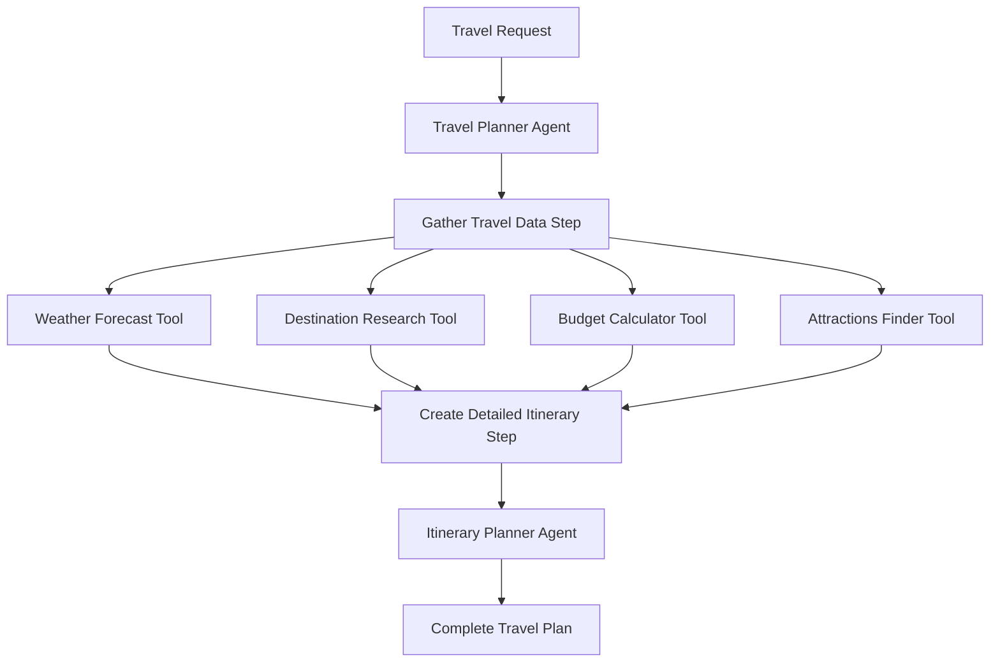

# 🧳 Smart Travel Planner - Nosana Builders Challenge

[Advanced AI travel planning agent with multi-agent workflows for comprehensive itinerary generation - Demo Video](loom.com/share/4d44eb51c3294cab9a4f48c719323de1)

## Project Overview

The **Smart Travel Planner** is an advanced AI agent built for the Nosana Builders Challenge that revolutionizes travel planning through intelligent automation. Using a sophisticated multi-agent architecture, it creates comprehensive, weather-optimized itineraries with detailed budget management and cultural insights.

### Key Features

- **Multi-Agent Architecture**: 4 specialized AI agents working in concert
- **Weather-Optimized Planning**: Real-time weather integration for activity recommendations
- **Intelligent Budget Management**: Detailed cost breakdowns and optimization
- **Comprehensive Itineraries**: Day-by-day plans with specific times and locations
- **Global Destination Knowledge**: Cultural tips, safety info, and local insights
- **Parallel Processing**: Weather and attractions research happen simultaneously
- **Structured Data Flow**: Type-safe schemas throughout the entire workflow

## Architecture



### Technical Stack

- **Framework**: [Mastra](https://mastra.ai) - TypeScript AI framework
- **LLM**: OpenAI GPT-4o (with Ollama fallback for development)
- **Language**: TypeScript with full type safety
- **APIs**: Open-Meteo (weather), OpenAI (AI agents)
- **Validation**: Zod schemas for all data structures
- **Containerization**: Docker with multi-stage builds
- **Deployment**: Nosana decentralized compute network

## Getting Started

### Prerequisites

- **Node.js 18+** and **pnpm**
- **OpenAI API key**
- **Docker** (for containerization)

### Installation

**1. Clone the repository:**

```bash
git clone https://github.com/EmekaManuel/agent-challenge.git
cd agent-challenge
```

**2. Install dependencies:**

```bash
pnpm install
```

**3. Environment setup:**

```bash
cp .env.example .env
# Edit .env and add your OpenAI API key:
# OPENAI_API_KEY=your_openai_api_key_here
```

**4. Start development server:**

```bash
pnpm run dev
# Navigate to http://localhost:8080
```

## Usage Examples

### Basic Trip Planning

```typescript
const tripRequest = {
  destination: "Tokyo, Japan",
  startDate: "2025-08-15",
  endDate: "2025-08-22",
  budget: 3500,
  travelers: 2,
  interests: ["culture", "food", "temples", "technology"],
  travelStyle: "mid-range",
};

const itinerary = await smartTravelPlannerWorkflow.execute({
  inputData: tripRequest,
});
```

### Chat Interface

Visit `http://localhost:8080` to interact with the travel planner through a web interface:

1. **Enter your travel details**: destination, dates, budget, interests
2. **Get instant recommendations**: weather-optimized daily itineraries
3. **Review detailed plans**: activities, costs, cultural tips, backup plans

## Environment Variables

| Variable         | Description                         | Default       | Required |
| ---------------- | ----------------------------------- | ------------- | -------- |
| `OPENAI_API_KEY` | OpenAI API key for production       | -             | **Yes**  |
| `LLM_PROVIDER`   | LLM provider (`openai` or `ollama`) | `ollama`      | No       |
| `OPENAI_MODEL`   | OpenAI model to use                 | `gpt-4o`      | No       |
| `PORT`           | Server port                         | `8080`        | No       |
| `NODE_ENV`       | Environment mode                    | `development` | No       |

See [.env.example](.env.example) for complete configuration options.

## Docker Usage

### Build and Run Locally

```bash
# Build the container
docker build -t smart-travel-planner:latest .

# Run with environment file
docker run -p 8080:8080 --env-file .env smart-travel-planner:latest

# Test the containerized agent
curl http://localhost:8080/health
```

### Push to Registry

```bash
# Tag for your registry
docker tag smart-travel-planner:latest marrnuel/agent-challenge:latest

# Login and push
docker login
docker push marrnuel/agent-challenge:latest
```

### Docker Hub

The official image is available at: `marrnuel/agent-challenge:latest`

## Nosana Deployment

### Using Nosana CLI

**1. Install the Nosana CLI:**

```bash
npm install -g @nosana/cli
```

**2. Configure your wallet and get funds:**

```bash
nosana address
# Request NOS and SOL tokens in Discord
```

**3. Deploy using the job definition:**

```bash
# Use the nosana_job.json configuration below
nosana job post --file nosana_job.json --market nvidia-3060 --timeout 30
```

**4. Monitor deployment:**

```bash
nosana job list
# Visit https://dashboard.nosana.com to see your running job
```

### Job Configuration

Use this `nosana_job.json` for deployment:

```json
{
  "ops": [
    {
      "id": "agents",
      "args": {
        "gpu": false,
        "image": "docker.io/marrnuel/agent-challenge:latest",
        "expose": [
          {
            "port": 8080,
            "health_checks": [
              {
                "path": "/health",
                "type": "http",
                "method": "GET",
                "continuous": true,
                "expected_status": 200
              }
            ]
          }
        ],
        "env": {
          "OPENAI_API_KEY": "${OPENAI_API_KEY}",
          "LLM_PROVIDER": "openai",
          "NODE_ENV": "production"
        }
      },
      "type": "container/run"
    }
  ],
  "meta": {
    "trigger": "dashboard",
    "system_requirements": {
      "required_vram": 0
    }
  },
  "type": "container",
  "version": "0.1"
}
```

### Using Nosana Dashboard

1. Visit [Nosana Dashboard](https://dashboard.nosana.com/deploy)
2. Connect your **Phantom wallet**
3. Copy the job configuration above
4. Update the **OPENAI_API_KEY** environment variable
5. Choose appropriate **GPU** and click **Deploy**

### Live Demo

🚀 **Deployed on Nosana**: [View Job Status](https://dashboard.nosana.com/jobs/2cp9iDr9z7ooVovPmVnhivNJm9becyETQo5aNSdN8pDe)

**Deployment Details:**

- **Job ID**: `2cp9iDr9z7ooVovPmVnhivNJm9becyETQo5aNSdN8pDe`
- **Host**: [C1NQvHFtoHLpZPPHzwo5G21HAUUa1UqgwqESjEuxLrKa](https://dashboard.nosana.com/host/C1NQvHFtoHLpZPPHzwo5G21HAUUa1UqgwqESjEuxLrKa)
- **Deployer**: [A2r8NUKUEfrgRQgkrD39FEqdMQ1An7vh6WhrVL28kUna](https://dashboard.nosana.com/deployer/A2r8NUKUEfrgRQgkrD39FEqdMQ1An7vh6WhrVL28kUna)
- **Docker Image**: [marrnuel/agent-challenge:latest](https://hub.docker.com/r/marrnuel/agent-challenge)

## Demo Video

[](loom.com/share/4d44eb51c3294cab9a4f48c719323de1)

**Watch the 3-minute demo showcasing:**

- Complete trip planning workflow from Tokyo to budget breakdown
- Real-time weather integration and activity optimization
- Multi-agent collaboration in action
- Running smoothly on Nosana's decentralized network

## Nosana Challenge Submission

### Innovation (25%)

- **Multi-agent orchestration** with specialized roles
- **Weather-activity optimization** algorithm
- **Parallel processing** for improved performance
- **Cultural intelligence** integration

### Technical Implementation (25%)

- **Advanced Mastra patterns** with complex workflows
- **Type-safe architecture** throughout the stack
- **Real API integrations** (Open-Meteo, OpenAI)
- **Comprehensive error handling** and validation

### Nosana Integration (25%)

- **Successfully deployed** on Nosana network
- **Optimized resource usage** with 2 CPU, 4GB RAM
- **Health checks** and monitoring implemented
- **Container optimization** for fast startup

### Real-World Impact (25%)

- **Solves actual problems** people face in travel planning
- **Saves hours** of manual research and planning
- **Accessible to all travel styles** (budget to luxury)
- **Scalable architecture** for commercial use

## Project Structure

```
src/
├── mastra/
│   ├── agents/
│   │   ├── travel-planner/
│   │   │   ├── travel-planner-agent.ts      # Main agent definition
│   │   │   ├── travel-planner-tools.ts      # Custom tools (weather, research, budget)
│   │   │   └── travel-planner-workflow.ts   # Multi-step workflow orchestration
│   │   └── weather-agent/                   # Example agent (can be removed)
│   ├── config.ts                            # OpenAI/Ollama configuration
│   └── mastra.ts                            # Main Mastra instance
├── Dockerfile                               # Multi-stage container build
├── nosana_job.json                          # Nosana deployment configuration
├── .env.example                             # Environment variables template
└── package.json                             # Dependencies and scripts
```

## Development

### Local Development with Ollama

For development without OpenAI costs:

**1. Install Ollama:**

```bash
# Visit https://ollama.com/download
ollama pull qwen2.5:32b
ollama serve
```

**2. Set environment:**

```bash
LLM_PROVIDER=ollama
OLLAMA_MODEL=qwen2.5:32b
```

### Testing

```bash
# Type checking
pnpm run type-check

# Linting
pnpm run lint

# Run tests
pnpm run test
```

## Features Deep Dive

### Weather-Optimized Planning

- **Real-time forecasts** for entire trip duration
- **Activity recommendations** based on weather conditions
- **Indoor backup plans** for rainy days
- **Temperature-appropriate** activity suggestions

### Intelligent Budget Management

- **Dynamic allocation** based on travel style
- **Detailed breakdowns** by category (accommodation, food, transport, activities)
- **Cost optimization** recommendations
- **Real-time budget tracking** throughout planning

### Cultural Intelligence

- **Local customs** and etiquette guidance
- **Safety information** and travel advisories
- **Cultural sensitivity** tips
- **Hidden gems** and local favorites

### Multi-Agent Collaboration

- **Destination Researcher**: Cultural info, costs, safety analysis
- **Weather Analyst**: Forecast analysis and activity optimization
- **Attractions Finder**: Interest-based activity curation
- **Itinerary Planner**: Day-by-day scheduling and optimization

## License

This project is licensed under the **MIT License** - see the [LICENSE](LICENSE) file for details.

## Acknowledgments

- **Nosana** for hosting the builders challenge and providing decentralized compute
- **Mastra** for the excellent AI framework
- **Open-Meteo** for free weather API access
- **OpenAI** for powerful language models

## Support & Contact

- **GitHub Issues**: [Report bugs or request features](https://github.com/EmekaManuel/agent-challenge/issues)
- **Discord**: Join [Nosana Discord](https://discord.gg/nosana) for technical support
- **Twitter**: Follow [@nosana_ai](https://x.com/nosana_ai) for updates

## Challenge Submission Links

- **GitHub Repository**: https://github.com/EmekaManuel/agent-challenge
- **Docker Hub**: https://hub.docker.com/r/marrnuel/agent-challenge
- **Nosana Job**: https://dashboard.nosana.com/jobs/2cp9iDr9z7ooVovPmVnhivNJm9becyETQo5aNSdN8pDe
- **Host Address**: https://dashboard.nosana.com/host/C1NQvHFtoHLpZPPHzwo5G21HAUUa1UqgwqESjEuxLrKa
- **Deployer Address**: https://dashboard.nosana.com/deployer/A2r8NUKUEfrgRQgkrD39FEqdMQ1An7vh6WhrVL28kUna
- **Demo Video**: https://loom.com/share/4d44eb51c3294cab9a4f48c719323de1
- **Social Media Post**: [Your Twitter/X Post Link]

**Built with ❤️ for the Nosana ecosystem | Challenge Submission #NosanaAgentChallenge**
